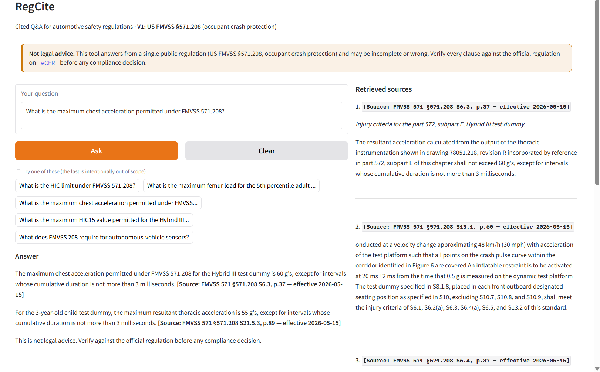

# Automotive Regulations RAG

A citation-grounded question-answering system for U.S. federal automotive safety regulations (FMVSS), built for homologation engineers and compliance consultants who otherwise spend hours searching 1000-page PDFs to verify a single clause.

> **Status:** V1 live — FMVSS §571.208 (occupant crash protection). Cited answers, honest refusals on out-of-scope questions, deployed demo.

## Demo

Live demo: https://huggingface.co/spaces/Priyerolkar/regcite

Ask a question about FMVSS §571.208 and get an answer with the exact regulation paragraph cited after each claim:



## What it does

Ask a natural-language question about FMVSS §571.208. Get a precise answer with the specific section, subsection, and page cited — so you can verify against the official regulation in seconds, not hours. When the retrieved text doesn't support an answer, it says so instead of guessing.

Example query: *"What is the HIC limit under FMVSS 571.208?"*

Example output:
> Under FMVSS 571.208, the maximum calculated HIC15 shall not exceed 700, and HIC36 shall not exceed 1,000, for the Hybrid III test dummy.
>
> [Source: FMVSS 571 §571.208 S6.2, p.37 — effective 2026-05-15]
>
> *This is not legal advice. Verify against the official regulation before any compliance decision.*

## Quickstart

```bash
git clone https://github.com/PriyankaYerolkar/automotive-regulations-rag.git
cd automotive-regulations-rag
uv sync --extra dev
uv run pytest
```

To try the tool itself, use the live demo above. Running the full pipeline locally also requires building the vector index (parse + embed) and setting `OPENAI_API_KEY` and `ANTHROPIC_API_KEY` — see `.env.example`.

## How it works

A standard RAG pipeline tuned for regulatory documents. The source PDF is parsed into paragraph-level chunks that keep their section number, page, and effective date as metadata; a question is embedded, the nearest chunks are retrieved and reranked toward relevance, and the model answers using only those chunks.

```
PDF -> parse (PyMuPDF) -> hierarchical chunk -> embed (text-embedding-3-small)
    -> Chroma vector store -> retrieve top-5 -> MMR rerank
    -> generate (Claude) with code-rendered paragraph citation
```

Two design choices do the trustworthiness work:

- **The model never writes its own citations.** The `[Source: ...]` tag is rendered by code from the chunk's metadata; the model only copies the tag of the paragraph it used. It cannot fabricate a section number, page, or effective date.
- **It refuses rather than guesses.** If retrieval doesn't support an answer, it returns *"I could not find this in the retrieved documents"* — which, for a compliance tool, is the feature, not a failure.

On a 30-question evaluation: citation accuracy 1.000, faithfulness 0.958, and zero hallucinations on adversarial questions designed to bait the model into citing clauses that don't exist.

Architecture notes: [docs/architecture.md](docs/architecture.md).

## Limitations

- V1 covers FMVSS §571.208 only. Anything outside it is refused by design; other FMVSS parts, AIS, Bharat Stage, and UNECE come later.
- It reads a fixed snapshot, not live law, and does not track amendments published after the snapshot date.
- Retrieval can miss part of a broad, aggregative question; the cited paragraph may not be the whole story.
- Not a substitute for legal review. The citation is where *you* verify, not the final word.
- English only.

## Roadmap

- Additional FMVSS Part 571 standards (side impact §571.214, child restraints §571.213)
- NHTSA Recall Intelligence dashboard
- AIS standards + Bharat Stage emission norms
- UNECE WP.29 regulations

## License

MIT — see [LICENSE](LICENSE).

## Author

Priyanka Yerolkar — automotive engineer (B.E. Mechanical, M.E. Automotive) working at the intersection of automotive regulation and applied GenAI. [LinkedIn](https://linkedin.com/in/priyankayerolkar) · [GitHub](https://github.com/priyankayerolkar)
